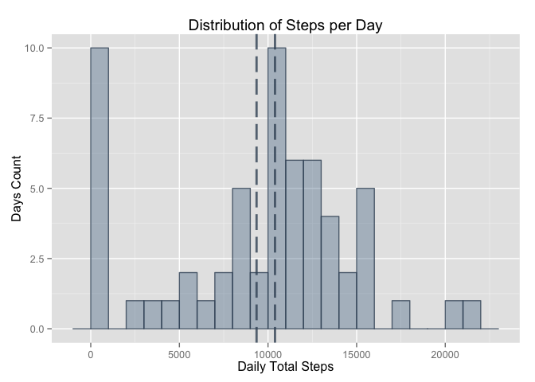
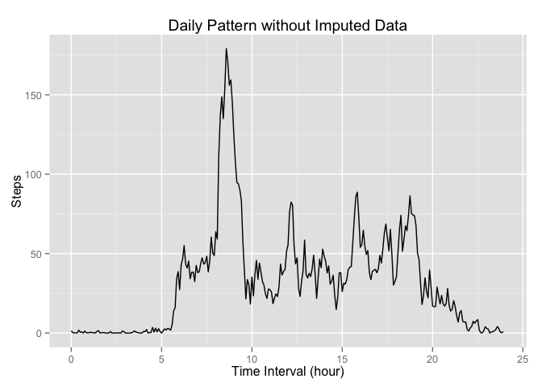
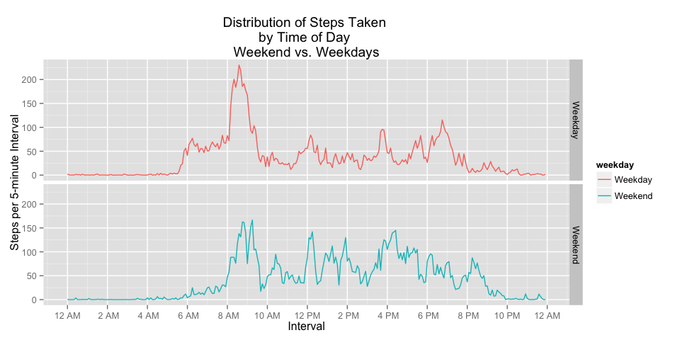

# Reproducible Research: Peer Assessment 1

## Loading and preprocessing the data

1. Load packages for data manipulation, processing and presentation. For more detailed
explanation of the packages as well as any unusual coding conventions please see 
Appendix B.


```r
library("data.table") # gives fast `fread()` and integer-based datetimes
library("dplyr") # good data manipulation and wrapper around data.frames or data.tables
library("magrittr") # facilitates function composition
library("ggplot2") # data plots
library("scales") # sets scalse for axes 
library("knitr") # explicit loading seems necessary for `kable()`
```

Note that the order packages are loaded does matter. For example, `between()` resolves 
to `dplyr::between()` rather `data.table::between()`, though it would be possible to 
call the `data.table` function explicitly.

2. Data come from:

Type          Notes
------------  -----
Remote URL    https://d396qusza40orc.cloudfront.net/repdata%2Fdata%2Factivity.zip
local zip     ./data/temp.zip
local csv     ./data/activity.csv
R object      dplyr::tbl_dt
local .RData  ./data/activity.RData

In reverse order (excluding the R object in RAM), local versions of the data are checked
for availability before attempting to re-download remote or less native formats.


```r
if (!file.exists("data/activity.zip")) {
  download.file(url = 
    "https://d396qusza40orc.cloudfront.net/repdata%2Fdata%2Factivity.zip", 
    method = "curl", destfile = "data/activity.zip", quiet = TRUE)
}

activity <- #pipe zip file through read.csv
  unz(description = "data/activity.zip", filename = "activity.csv") %>% 
  read.csv %>% 
  data.table %>% # and convert to datatable in dplyr container
  tbl_dt 
```

Next we alter the loaded table using `dplyr`'s mutate function

1. Convert date to integer-based `IDate` class from `data.table` package. Though 
not useful for this smaller data table, it can sort more quickly with very large 
data sets
2. Likewise, `ITime` an integer time format is calculated from the `interval` column. 
  - `Interval <integer division> 100` gives the hours
  - `Interval <modulo> 100` gives the minutes 
3. `date, time` is created as a data.table key, thereby accelerating any future 
access of the data.


```r
activity %<>% # this operator pipes activity to mutate, AND modifies it in place
    mutate(date=as.IDate(date), time=as.ITime(
       sprintf("%02d:%02d", interval %/% 100, interval  %% 100)))
setkey(x = activity, date, time)
```

Now "activity" looks like:


```r
str(activity)
```

```
## Classes 'tbl_dt', 'tbl', 'data.table' and 'data.frame':	17568 obs. of  4 variables:
##  $ steps   : int  NA NA NA NA NA NA NA NA NA NA ...
##  $ date    : IDate, format: "2012-10-01" "2012-10-01" ...
##  $ interval: int  0 5 10 15 20 25 30 35 40 45 ...
##  $ time    :Class 'ITime'  int [1:17568] 0 300 600 900 1200 1500 1800 2100 2400 2700 ...
##  - attr(*, ".internal.selfref")=<externalptr> 
##  - attr(*, "sorted")= chr  "date" "time"
```

```r
head(activity) %>% kable
```


 steps  date          interval       time
------  -----------  ---------  ---------
    NA  2012-10-01           0   00:00:00
    NA  2012-10-01           5   00:05:00
    NA  2012-10-01          10   00:10:00
    NA  2012-10-01          15   00:15:00
    NA  2012-10-01          20   00:20:00
    NA  2012-10-01          25   00:25:00

## What is mean total number of steps taken per day?

To summarize the data into total steps taken per day, we could drop all time 
intervals that include an NA

```
activity %>% filter(!is.na(steps)) %>% group_by(date) %>% summarise(sum(steps))
```

However, that completely drops some dates, such as 2012-10-01 and 2012-11-01,
which have no valid measurements. At this point in the assignment, rather than 
imputing missing values, we are trying to show the limitations of ignoring 
the NAs. One way to do this is to read the NAs as zeros which simply do not add 
to the sum of steps.


```r
activity <- activity %>% 
    mutate(stepsZeroNAs = ifelse(test = is.na(steps), yes = 0, no = steps))
#stepsZeroNAs column = Steps with ZERO in place of NAs

stepCounts <- activity %>% 
    group_by(date) %>% 
    summarise(stepsZeroNAs=sum(stepsZeroNAs))
```

Now, lets build a histogram of the data using ggplot2

```r
# color
tempHue <- 0.58 
ColA.light <- hsv(h = tempHue, s = 0.4, v = 0.6, alpha = 0.4)
ColA.dark <- hsv(h = tempHue, s = 0.4, v = 0.4, alpha = 0.8)
# mean and median
meanstepsZeroNAs <- mean(stepCounts$stepsZeroNAs) 
medianstepsZeroNAs <- median(stepCounts$stepsZeroNAs)

dailySteps <- 
  # choose data
  ggplot(data = stepCounts) +
  # aesthetics, one series => histogram
  aes(x = stepsZeroNAs) +
  # geometric details of histogram, including coloring
  geom_histogram(fill=ColA.light, colour=ColA.dark, binwidth = 1000) +
  # annotate mean and median values
  geom_vline(xintercept=meanstepsZeroNAs, colour=ColA.dark, size=1.0, linetype="longdash") +
  geom_vline(xintercept=medianstepsZeroNAs, colour=ColA.dark, size=1.0, linetype="longdash") +
  # Add labels
  labs(
    title = "Distribution of Steps per Day", 
    x = "Daily Total Steps", y = "Days Count")

# execute the plot
dailySteps
```

 

**9354** is the **mean** number of steps 
taken in a day, as calculated from data where NA is treated like no steps in 
that time period

**10395** is the **median**, using the same data

## What is the average daily activity pattern?

Calculate typical daily pattern, with NAs ignored and with NAs treated as zero.

```r
dailyPattern <- activity %>%
    group_by(time) %>% 
    summarise(stepsZeroNAs=mean(stepsZeroNAs), 
              stepsTypical=mean(steps, na.rm = TRUE), interval=mean(interval))
setkey(dailyPattern, time)
```
Then plot the data


```r
qplot(data = dailyPattern, y=stepsZeroNAs, x=time/3600, geom="line", 
      xlim = c(0, 24), xlab="Time Interval (hour)", ylab="Steps", 
      main="Daily Pattern without Imputed Data")
```

 

From this calculation, we can note that typically, the most active 5-minute 
interval during the day starts at:

```r
dailyPattern[stepsZeroNAs==max(dailyPattern$stepsZeroNAs), interval, time] %>% kable
```

     time   interval
---------  ---------
 08:35:00        835

## Imputing missing values

The original data set contained **``2304``** NAs, 
out of a total **``17568``** observations.

The typical number of steps at each time interval during the day was calculated 
in the previous section

```
dailyPattern <- activity %>%
    group_by(time) %>% 
    summarise(stepsZeroNAs=mean(stepsZeroNAs), 
              stepsTypical=mean(steps, na.rm = TRUE))
```

This table can be used to impute typical values for the NAs in the original 
data set. It covers all time intervals during the day covered by the earlier 
method of turing NAs into zeroes:

```r
length(unique(dailyPattern$stepsTypical)) == length(unique(dailyPattern$stepsZeroNAs))
```

```
## [1] TRUE
```

And, it contains no NAs:

```r
sum(is.na(length(unique(dailyPattern$stepsTypical))))
```

```
## [1] 0
```

This table can be used to create a new column in the original data set that 
imputes missing values from the typical daily pattern in cases there were 
NA values previously.


```r
activity <- activity %>% 
    mutate(stepsTypical = ifelse(
        test = is.na(steps), 
        yes = dailyPattern[time==time, stepsTypical],
        no = steps))
```

These new data can be plotted like before:


```r
# add imputed data
stepCounts <- activity %>% 
    group_by(date) %>% 
    summarise(stepsZeroNAs=sum(stepsZeroNAs),
              stepsImputed=sum(stepsTypical)) 

# mean and median
meanstepsImputed <- mean(stepCounts$stepsImputed)
medianstepsImputed <- median(stepCounts$stepsImputed) 

# new colors
tempHue <- 0.88
    ColB.light <- hsv(h = tempHue, s = 0.4, v = 0.6, alpha = 0.4)
    ColB.dark <- hsv(h = tempHue, s = 0.4, v = 0.4, alpha = 0.8)

# build the plot
dailySteps.Imputed <- 
  # choose data
  ggplot(data = stepCounts) +
  # aesthetics, one series => histogram
  aes(x = stepsImputed) +
  # geometric details of histogram, including coloring
  geom_histogram(fill=ColB.light, colour=ColB.dark, binwidth = 1000) +
  # annotate mean and median values
  geom_vline(xintercept=meanstepsImputed, colour=ColB.dark, size=1.0, linetype="longdash") +
  geom_vline(xintercept=medianstepsImputed, colour=ColB.dark, size=1.0, linetype="longdash") +
  # Add labels
  labs(
    title = "Distribution of Steps per Day (With Imputed Data)", 
    x = "Daily Total Steps", y = "Days Count")

# execute the plot
dailySteps.Imputed
```

 


## Are there differences in activity patterns between weekdays and weekends?


```r
activity <- activity %>%
  mutate(weekday= ifelse(
    weekdays(date) %in% c("Saturday", "Sunday"), 
    "Weekend", 
    "Weekday"))

dailyPattern.split <- activity %>%
    group_by(time, weekday) %>%
    summarise(time, steps=mean(stepsTypical))

ggplot(data = dailyPattern.split, aes(x = as.POSIXct(time), y = steps, color = weekday)) + 
  scale_x_datetime(breaks = date_breaks("2 hour"), labels = date_format("%l %p")) +
  # See documentation for `scales` package to understand `scale_x_datetime`,
  # `date_breaks` and `date_format` transformation of times along x-axis
  facet_grid(weekday ~ .) + geom_line() + 
  labs(title = sprintf(
    "Distribution of Steps Taken \nby Time of Day \nWeekend vs. Weekdays"), 
    x = "Interval", y = "Steps per 5-minute Interval")
```

 

And, just for fun here is an additional plot of the data

```r
ggplot(data = activity, aes(x = as.POSIXct(time), y = stepsTypical, colour = weekday, fill = weekday)) + 
  scale_x_datetime(breaks = date_breaks("2 hour"), labels = date_format("%l %p")) + 
  stat_smooth(method = "gam") +  geom_smooth(level = 0.8) + 
  geom_point(alpha=0.5, size=1, position = "jitter") +
  labs(title = sprintf(
    "Distribution of Steps Taken \nby Time of Day \nWeekend vs. Weekdays"), 
    x = "Time of Day", y = "Steps per 5-minute Interval")
```

 

And, zooming in on the smoothed data

```r
ggplot(data = activity, 
       aes(x = as.POSIXct(time), y = stepsTypical, colour = weekday, fill = weekday)) + 
  scale_x_datetime(breaks = date_breaks("2 hour"), labels = date_format("%l %p")) +
  stat_smooth(method = "gam") +  geom_smooth(level = 0.6) +
  labs(title = sprintf("Distribution of Steps Taken \nby Time of Day \nWeekend vs. Weekdays"), 
       x = "Time of Day", y = "Steps per 5-minute Interval")
```

 

## Appendix A: Environment


```r
sessionInfo()
```

```
## R version 3.2.0 (2015-04-16)
## Platform: x86_64-apple-darwin13.4.0 (64-bit)
## Running under: OS X 10.10.3 (Yosemite)
## 
## locale:
## [1] en_US.UTF-8/en_US.UTF-8/en_US.UTF-8/C/en_US.UTF-8/en_US.UTF-8
## 
## attached base packages:
## [1] stats     graphics  grDevices utils     datasets  methods   base     
## 
## other attached packages:
## [1] mgcv_1.8-6       nlme_3.1-120     knitr_1.10.5     scales_0.2.4    
## [5] ggplot2_1.0.1    magrittr_1.5     dplyr_0.4.1      data.table_1.9.4
## 
## loaded via a namespace (and not attached):
##  [1] Rcpp_0.11.6      MASS_7.3-40      munsell_0.4.2    lattice_0.20-31 
##  [5] colorspace_1.2-6 highr_0.5        stringr_1.0.0    plyr_1.8.2      
##  [9] tools_3.2.0      parallel_3.2.0   grid_3.2.0       gtable_0.1.2    
## [13] DBI_0.3.1        htmltools_0.2.6  lazyeval_0.1.10  yaml_2.1.13     
## [17] digest_0.6.8     assertthat_0.1   Matrix_1.2-0     reshape2_1.4.1  
## [21] formatR_1.2      evaluate_0.7     rmarkdown_0.6.1  labeling_0.3    
## [25] stringi_0.4-1    chron_2.3-45     proto_0.3-10
```

## Appendix B: Notes on Selected R Packages

### dplyr 0.4.1 

- summary https://github.com/hadley/dplyr/blob/v0.4.1/README.md
- news https://github.com/hadley/dplyr/blob/v0.4.1/NEWS.md

**Dplyr** by Hadley Wickam builds upon the earlier `plyr` package for data 
manipulation and shaping for analysis. Execution speed approaches that of 
`data.table` with syntax patterns that are arguabley more consistent with 
other R packages. Additionally, `dplyr` can serve as a wrapper around 
`data.table` objects.

Note that `dplyr` also automatically imports `magrittr`, though it is a subset of 
the features without the `%<>%` operator, for example.

- `mutate()` - This function takes a data.frame or data.table in dplyr and adds 
columns with values as specified. It leaves existing columns in place regardless 
of whether they are specified. This is in contrast to `transmute()` which drops 
any existing columns that are not specified to be output.

- `group_by()` & `summarise()` - Replicate functinality found in base R 
functions like `aggregate()`, `*apply()`, `by()` and `subset()`


### magrittr 1.5

- overview https://github.com/smbache/magrittr/blob/v.1.5/README.md
- vignettes http://cran.r-project.org/web/packages/magrittr/vignettes/magrittr.html

**Magrittr** supplies a "forward pipe" operator `%>%` which is useful for 
composing functions. The following two expressions:

    order(upper(c("c", "b", "a")))

is equivalent to:

    c("c", "b", "a") %>%
        upper() %>%
        order()

Additional examples:


```r
add(2, 3)
```

```
## [1] 5
```

```r
2 %>% add(3)
```

```
## [1] 5
```

```r
x <- 4
x %>% add(3) # value of x plus 3, x is not changed
```

```
## [1] 7
```

```r
x
```

```
## [1] 4
```

```r
# Like x <- x %>% add(3):
x %<>% add(3) # value of x plus 3, x IS changed.
x
```

```
## [1] 7
```


### scales 0.2.4

Required for ggplot2's `scale_x_dateime` http://docs.ggplot2.org/current/scale_datetime.html

### tidyr 0.2.0 

- summary https://github.com/hadley/tidyr/blob/v0.2.0/README.md
- source https://github.com/hadley/tidyr
- CRAN http://cran.r-project.org/web/packages/tidyr/index.html

**Tidyr** can be used to shape data. In database theory, such operation are equivalent to changing between different normal forms. Tidyr focuses around `gather()`, which makes wide tables tall, and `spread()` which makes tall tables wide.
